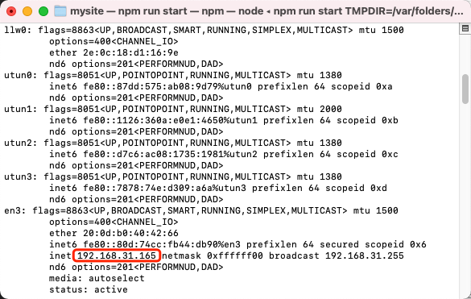

## 配置webpack

终端输入`ifconfig`查看ip地址



然后访问`ip:8080`，发现拒绝访问，这是因为默认的webpack配置不允许通过ip地址访问。只需要在 package.json > scripts > dev 添加`--host 0.0.0.0`
```
"dev": "webpack-dev-server --host 0.0.0.0 --inline --progress --config build/webpack.dev.conf.js"
```
然后就可以通过ip地址访问了。这时将手机和电脑连入同一个局域网，即可通过手机上机测试。

## 字母列表问题

在拖动字母列表时发现整个页面也会被拖动，需要清除事件的默认动作。在控制字母列表的li标签中将 `@touchstart="handleTouchStart"` 改为 `@touchstart.prevent="handleTouchStart"` 即可。

## 低版本浏览器白屏问题

一部分是因为浏览器不支持es6的promise属性，需要安装 `babel-polyfill`
```
npm install babel-polyfill --save

然后再main.js中引入即可

import 'babel-polyfill'
```