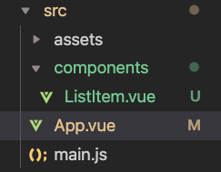
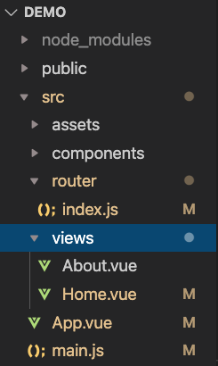
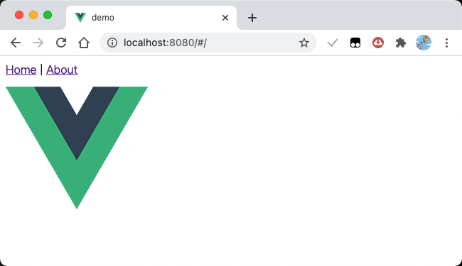
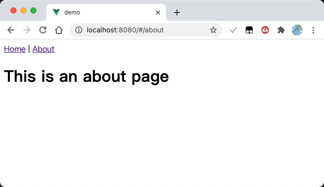
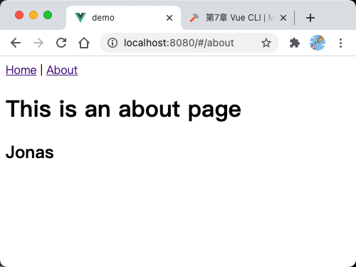
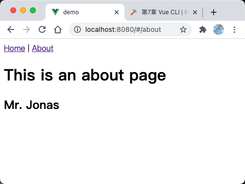
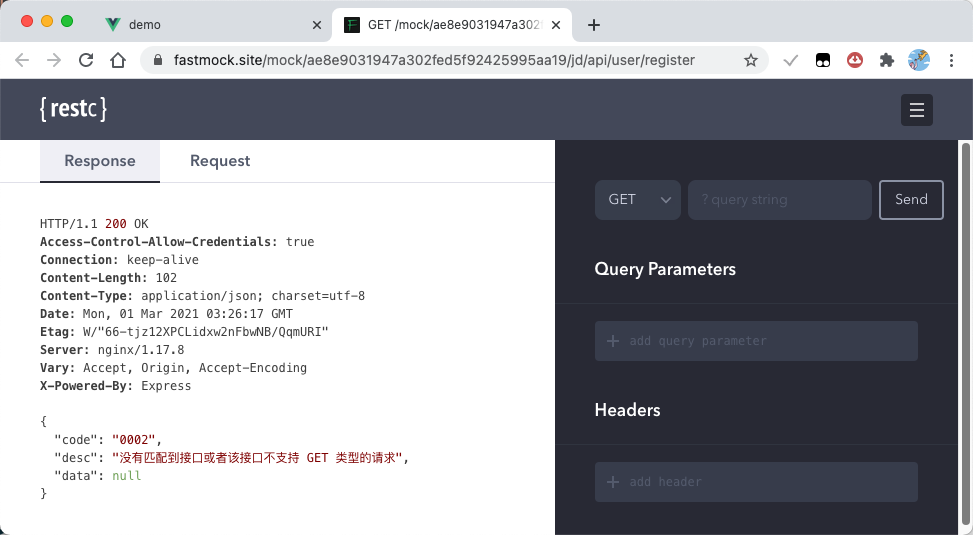
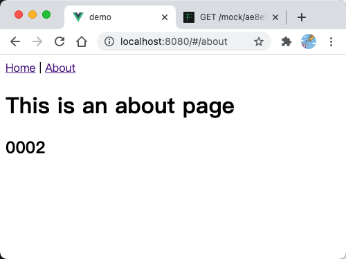

## VueCLI 安装

安装：`npm install @vue/cli`
创建项目：`vue create project_name`
手动选择需要的配置项即可。创建 future project 那里选 No 即可。


如果拿到别人的文件，是没有 node_modules 文件夹的，可以先在终端 `npm install` 把依赖安装好，然后 `npm run serve` 就可以启动了。

## 单文件应用



to-do list

```js title="/src/main.js"
import { createApp } from "vue";
import App from "./App.vue";

createApp(App).mount("#app");
```

```html title="/src/App.vue"
<template>
  <div>
    <input v-model="inputValue" />
    <button class="btn" @click="handleAddItem">提交</button>
  </div>
  <ul>
    <list-item v-for="(item, index) of list" :key="index" :msg="item" />
  </ul>
</template>

<script>
  import { reactive, ref } from "vue";
  import ListItem from "./components/ListItem";

  export default {
    name: "App",
    components: {
      ListItem,
    },
    setup() {
      const inputValue = ref("");
      const list = reactive([]);

      const handleAddItem = () => {
        list.push(inputValue.value);
        inputValue.value = "";
      };
      return { handleAddItem, inputValue, list };
    },
  };
</script>

<style scoped>
  /* 不加scoped会对子组件生效 */
  .btn {
    margin-left: 20px;
    color: blue;
  }
</style>
```

```html title="/src/components/ListItem.vue"
<template>
  <li>{{msg}}</li>
</template>

<script>
  export default {
    name: "ListItem",
    props: {
      msg: String,
    },
  };
</script>

<style></style>
```

## Vue-Router

创建项目时选择 vue-router，不使用 history mode，也就是使用哈希路由(带井号的那种）。



会发现 main.js 多了个路由插件。路由是指根据 url 的不同，展示不同的内容。

```js title="/src/main.js"
import { createApp } from "vue";
import App from "./App.vue";
import router from "./router";

// 路由是指根据url的不同，展示不同的内容。
createApp(App).use(router).mount("#app");
```

```js title="/src/router/index.js"
import { createRouter, createWebHashHistory } from "vue-router";
import Home from "../views/Home.vue";

const routes = [
  {
    path: "/",
    name: "Home",
    component: Home,
  },
  {
    path: "/about",
    name: "About",
    // 懒加载的写法，异步加载路由。不访问时不加载
    component: () => import("../views/About.vue"),
  },
];

const router = createRouter({
  history: createWebHashHistory(),
  routes,
});

export default router;
```

```html title="/src/App.vue"
<template>
  <div id="nav">
    <!-- router-link是跳转路由的标签 -->
    <router-link to="/">Home</router-link> |
    <router-link to="/about">About</router-link>
  </div>
  <!-- router-view负责展示当前路由对应的组件内容 -->
  <router-view />
</template>

<style></style>
```

```html title="/src/views/Home.vue"
<template>
  <div class="home">
    
  </div>
</template>

<script>
  export default {
    name: "Home",
  };
</script>
```

```html title="/src/views/About.vue"
<template>
  <div class="about">
    <h1>This is an about page</h1>
  </div>
</template>
```





## VueX 数据管理框架

VueX 的结构：

```js title="/src/store/index.js"
import { createStore } from "vuex";
// VueX 数据管理框架
// VueX创建了一个全局唯一的仓库，用来存放全局的数据
export default createStore({
  state: {
    name: "Jonas",
  },
  mutations: {},
  actions: {},
  modules: {},
});
```

要修改 store 里的数据，需要经过以下几个步骤：

- 第一步，派发(dispatch)一个 action
- 第二步，store 感知到你触发了一个 action，执行这个 action
- 第三步，提交一个 commit，触发一个 mutation
- 第四步，对应的 mutation 被执行
- 第五步，在 mutation 里修改数据

举个例子。点击标题，把 Jonas 改成 Mr. Jonas

```html title="/src/views/About.vue"
<template>
  <div class="about">
    <h1 @click="handleClick">This is an about page</h1>
    <h2>{{myName}}</h2>
  </div>
</template>

<script>
  export default {
    name: "Home",
    computed: {
      myName() {
        return this.$store.state.name;
      },
    },
    methods: {
      handleClick() {
        // 想改变数据，vuex要求
        // 第一步，派发(dispatch)一个action
        this.$store.dispatch("change", "Mr.");
      },
    },
  };
</script>
```



```js title="/src/store/index.js"
import { createStore } from "vuex";
// VueX 数据管理框架
// VueX创建了一个全局唯一的仓库，用来存放全局的数据
export default createStore({
  state: {
    name: "Jonas",
  },
  mutations: {
    // 第四步，对应的mutation被执行
    // mutation里只允许写同步代码。异步代码要写在action里
    changeName(state, str) {
      // 第五步，在mutation里修改数据
      // this.state.name = 'lee'
      state.name = str + " " + state.name;
    },
  },
  actions: {
    // 第二步，store感知到你触发了一个叫做change的action，执行change
    change(store, str) {
      // 第三步，提交一个commit，触发一个mutation
      setTimeout(() => {
        // this.commit('changeName')
        store.commit("changeName", str);
      }, 2000);
    },
  },
  modules: {},
});
```

点击标题，2s 后：



若不涉及异步操作，可以不经过 action，直接 commit 调用 mutation

```js
methods: {
  handleClick() {
    // 想改变数据，vuex要求
    // 第一步，派发(dispatch)一个action
    // this.$store.dispatch('change', 'Mr.')
    this.$store.commit('changeName', 'Mrs.')
  }
}
```

## 使用 Composition API 写 VueX

- 要使用 useStore

```html
<template>
  <div class="about">
    <h1 @click="handleClick">This is an about page</h1>
    <h2>{{name}}</h2>
  </div>
</template>

<script>
  import { toRefs } from "vue";
  import { useStore } from "vuex";

  export default {
    name: "Home",
    setup() {
      const store = useStore();
      // const name = store.state.name;
      const { name } = toRefs(store.state);
      const handleClick = () => {
        store.commit("changeName", "Mr.");
      };
      return { name, handleClick };
    },
  };
</script>
```

## axios 获取数据

安装 axios：`npm install axios --save`

```html title="/src/views/About.vue"
<template>
  <div class="about">
    <h1 @click="handleClick">This is an about page</h1>
    <h2>{{name}}</h2>
  </div>
</template>

<script>
  import { toRefs } from "vue";
  import { useStore } from "vuex";

  export default {
    name: "Home",
    setup() {
      const store = useStore();
      // const name = store.state.name;
      const { name } = toRefs(store.state);
      const handleClick = () => {
        store.dispatch("getData");
      };
      return { name, handleClick };
    },
  };
</script>
```

```js title="index.js"
import { createStore } from "vuex";
import axios from "axios";

export default createStore({
  state: {
    name: "Jonas",
  },
  mutations: {
    changeName(state, str) {
      state.name = str;
    },
  },
  actions: {
    getData(store) {
      axios
        .get(
          "https://www.fastmock.site/mock/ae8e9031947a302fed5f92425995aa19/jd/api/user/register"
        )
        .then((response) => {
          const msg = response.data.code;
          console.log(msg);
          store.commit("changeName", msg);
        });
    },
  },
  modules: {},
});
```

点击标题，获取 ajax 里的数据





