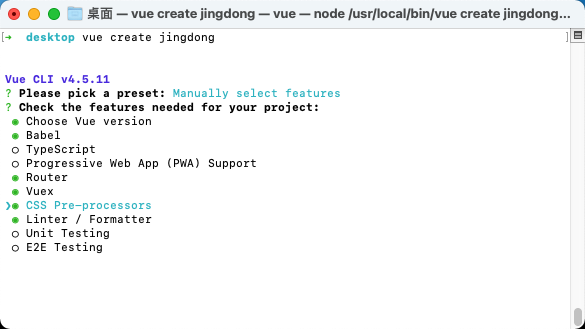
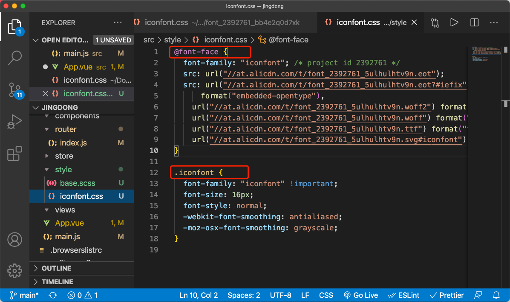
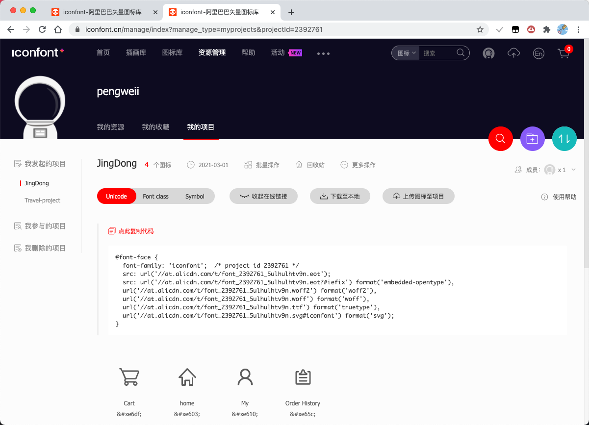

## 创建项目

手动选择需要的东西，创建项目



使用 eslint prettier
`npm install --save-dev eslint-config-prettier`
然后在项目的 `.eslintrc.js` 中的 extends 添加 `prettier`。

安装 normalize.css，抹平各浏览器之间的差异
`npm install normalize.css --save`
然后在 main.js 中引入 `import "normalize.css"`

然后创建 `/src/style/base.scss` ：

```css
html {
  font-size: 100px;
}
body {
  font-size: 12px;
}
```

定义 1rem = 100px

同样，在 main.js 中引入：`import "./style/base.scss"`

## iconfont 使用

在 iconfont 创建项目，添加需要的图标，然后下载至本地。打开下载的压缩包，将 iconfont.cssd 的关键代码复制，到 style 里新建 iconfont.css，粘贴下来。若不想保存到本地，可以在 iconfont 网站上生成 cdn 代码，粘贴至本地即可。

只复制这两部分即可




然后再在 main.js 中引入
