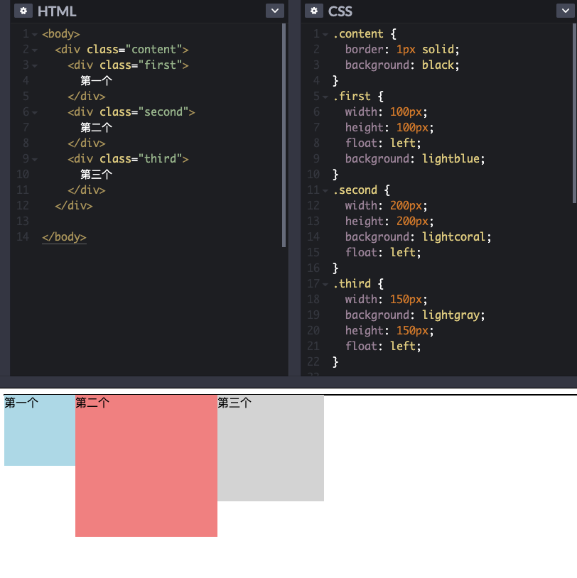
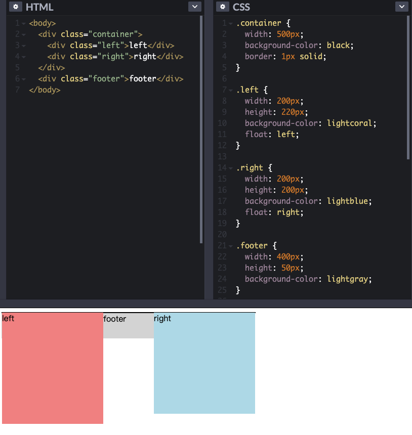
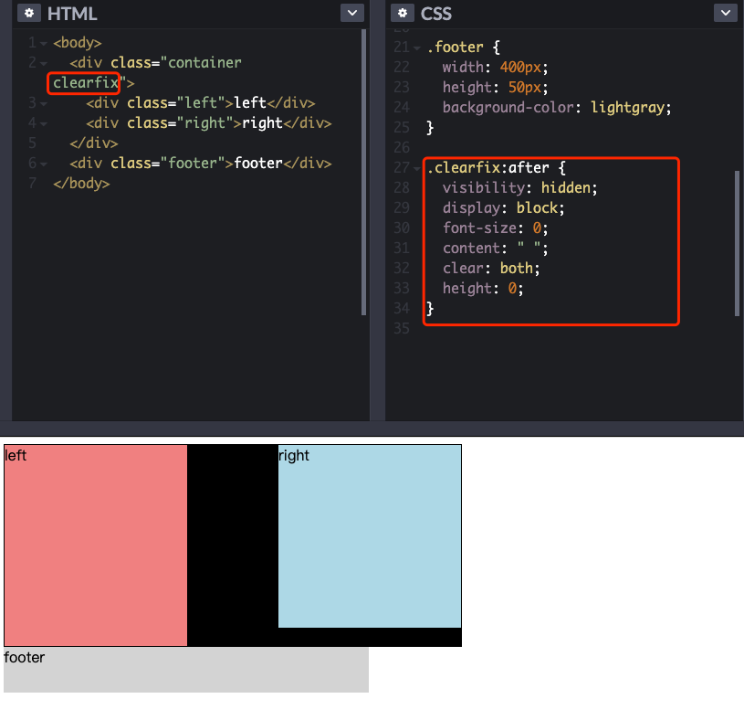

## 清除浮动clearfix

通常我们在写html+css的时候，如果一个父级元素内部的子元素是浮动的（float），那么常会发生父元素不能被子元素正常撑开的情况，如下图所示：



可以看到，content这个父元素完全没有被子元素撑开（我定义content元素背景为黑色，有边框，现在只显示了一条线）；

再举一个例子：



我们可以看到，虽然footer在container外部，却没位于底端，因为container内部子元素为float，导致container并没有被撑开；

如果我们给footer添加 clear:both;，布局问题可以被解决，但是container依旧没有被撑开，有一种强行解决问题的感觉。

要解决此问题，我们可以给container添加一个类，叫做clearfix，下面是clearfix的实现形式（之一）：

``` css
.clearfix:after {
  visibility: hidden;
  display: block;
  font-size: 0;
  content: " ";
  clear: both;
  height: 0;
}
```



原文：https://www.cnblogs.com/wwHww/p/9183481.html